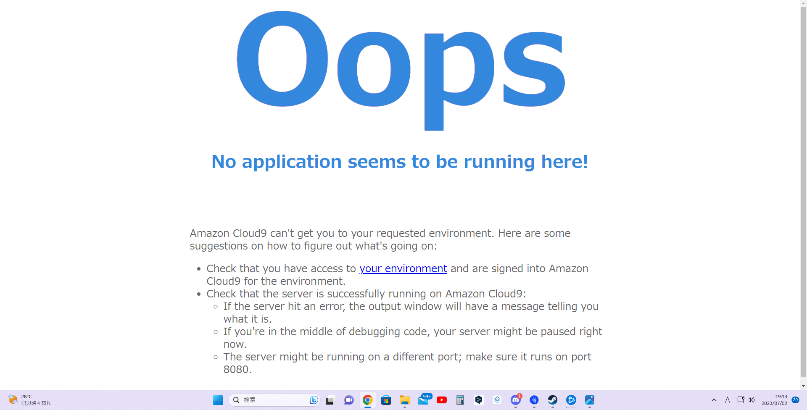
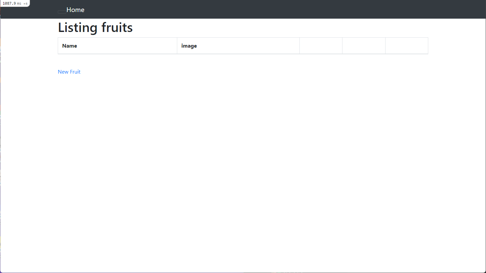
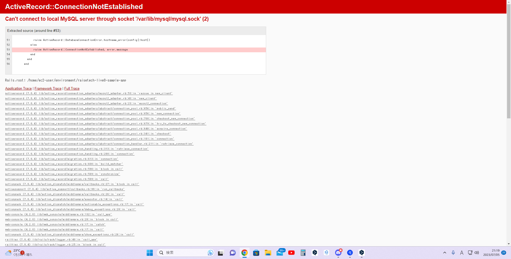

# 第三回の課題

### APサーバーの名前、バージョンの確認の確認

* 名前　puma 
* バージョン　5.6.5

### APサーバー終了時の起動確認

* APサーバーの終了していると、アプリは起動出来ない。再びAPサーバーを起動させるとアプリを起動出来た。
  
 

## DBサーバーの名前、バージョン

* 名前 MySQL
* バージョン　8.0.33 

## DBサーバー終了時の動作確認

* DBサーバーを終了すると、アプリは動かない

 

## railsの構成管理ツール

* bundler

## 学んだ事
* HTTPメソッドのGETとPOSTについて
* アプリケーション開発のプロセスモデル　V字、W字モデル
* Ruby on Railsというフレームワークを使ったアプリ起動
* 外部ライブラリと構成管理　gemで外部ライブラリをまとめて利用する。undlerでgemの種類やバージョンを管理する
* APサーバーDBサーバーについて
* アプリケーションのデプロイ

