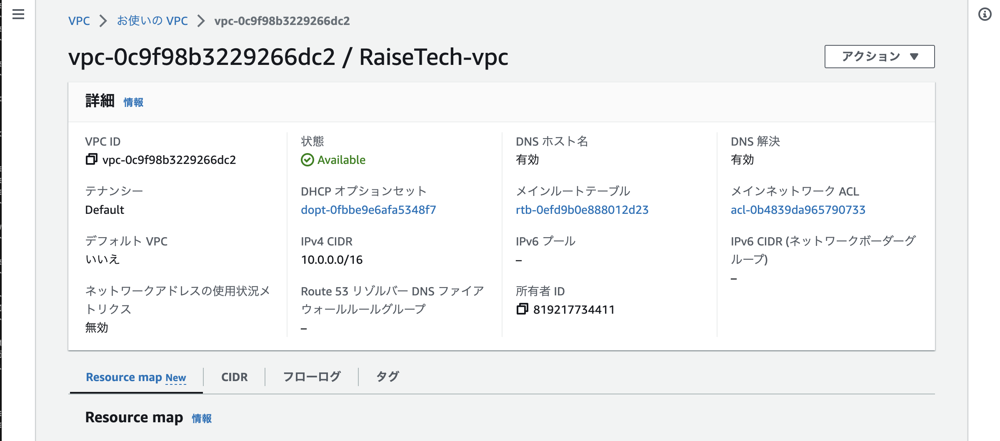
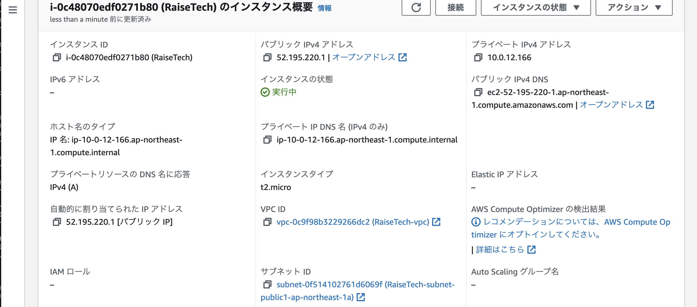
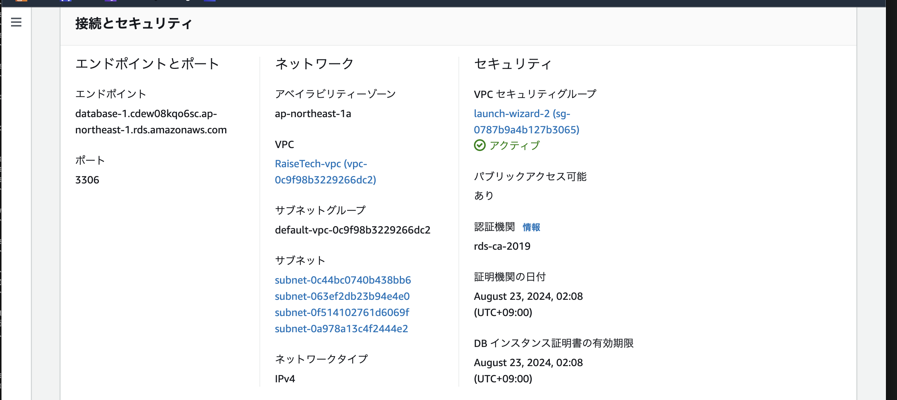
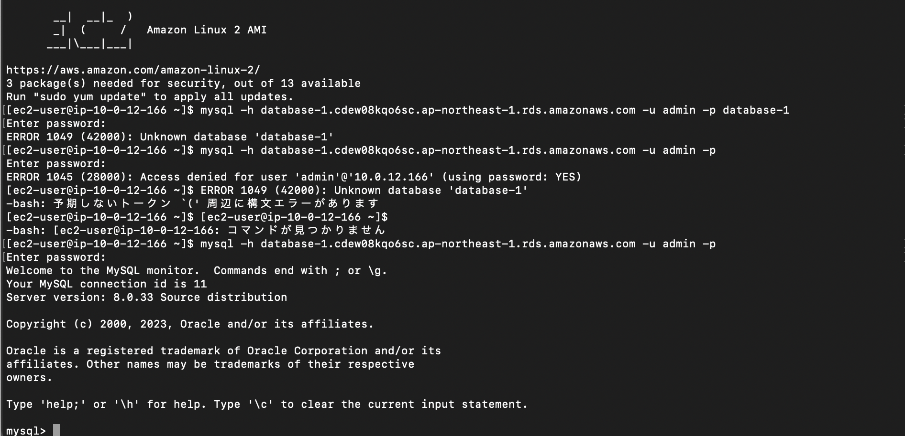

# 第4回目の課題

## VPCの作成

## EC2の作成

## RDSの作成

EC2にSSHクライアントで接続

RDSに接続

##　学んだこと

EC2とRDSの作り方を間違えたりして何回も作り直してしまったので次は気をつける
osを間違えたり、パブリックIPアドレスを作らない設定して上手く接続できずにいた。

RDSの接続も手こずった　MySQLのコマンドを理解していなかったりパスワードを入力しても接続出来ず、セキュリティーグループのインバウンドルールに設定を追加しても出来ず、最終的にRDSのパスワードをリセットしたら接続できた。
どれが有効的だったのかはわからなかった。