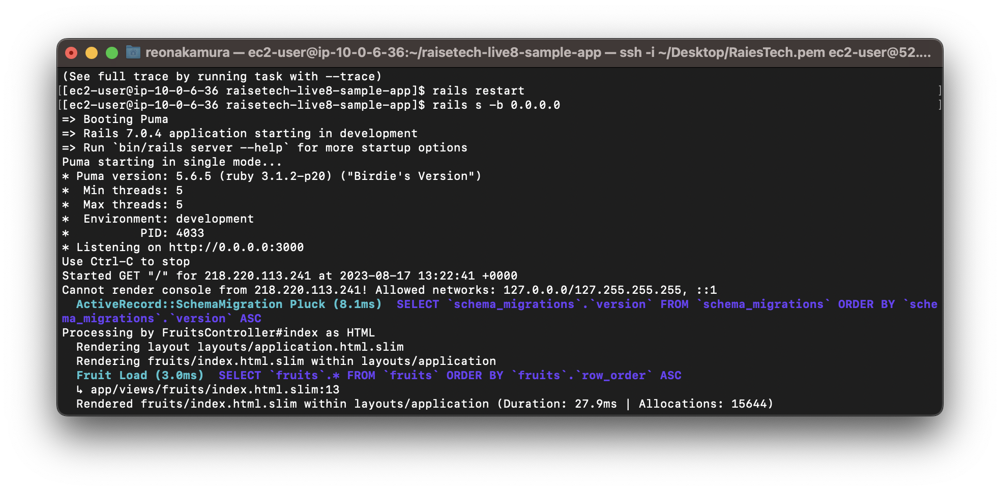
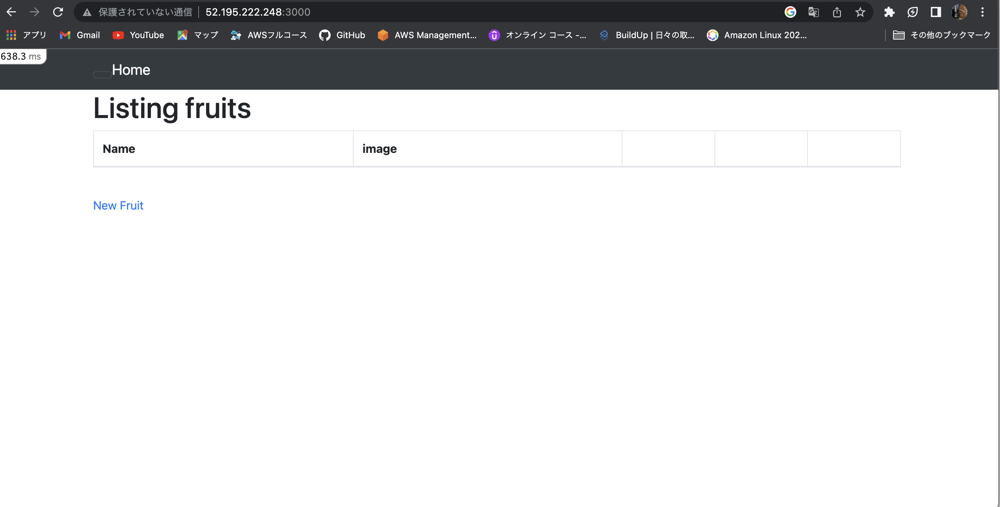
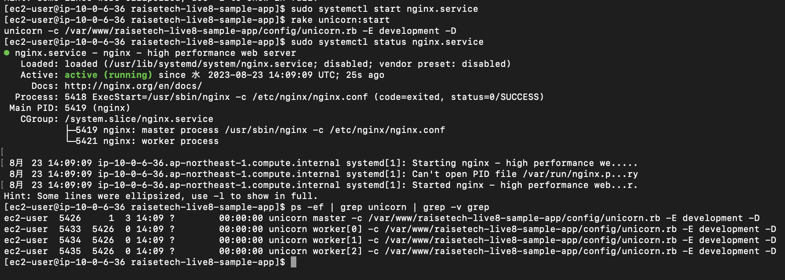
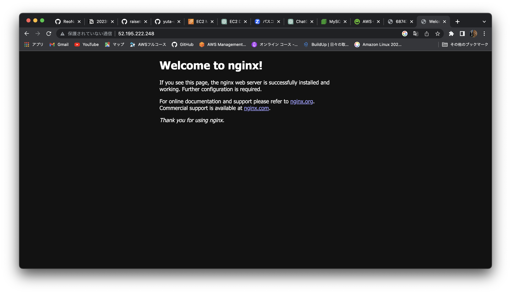
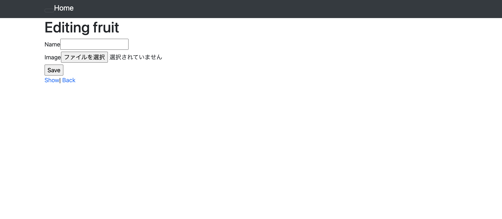
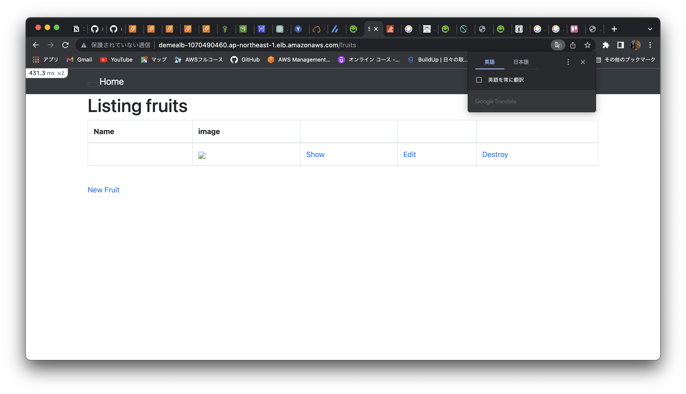
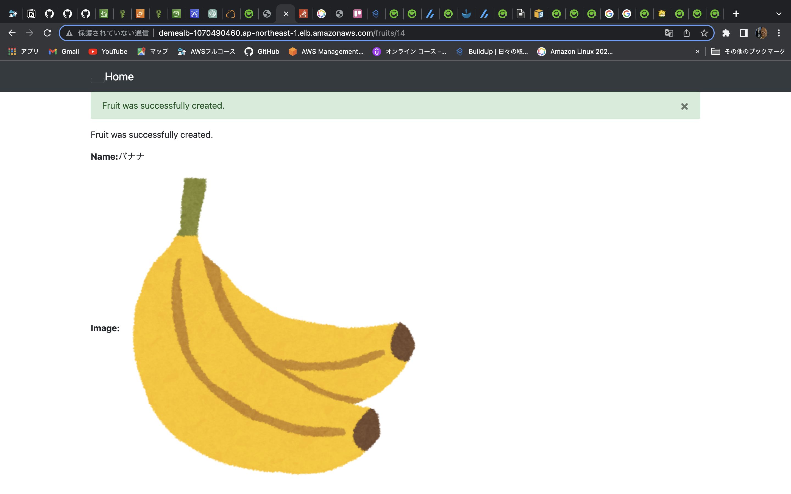
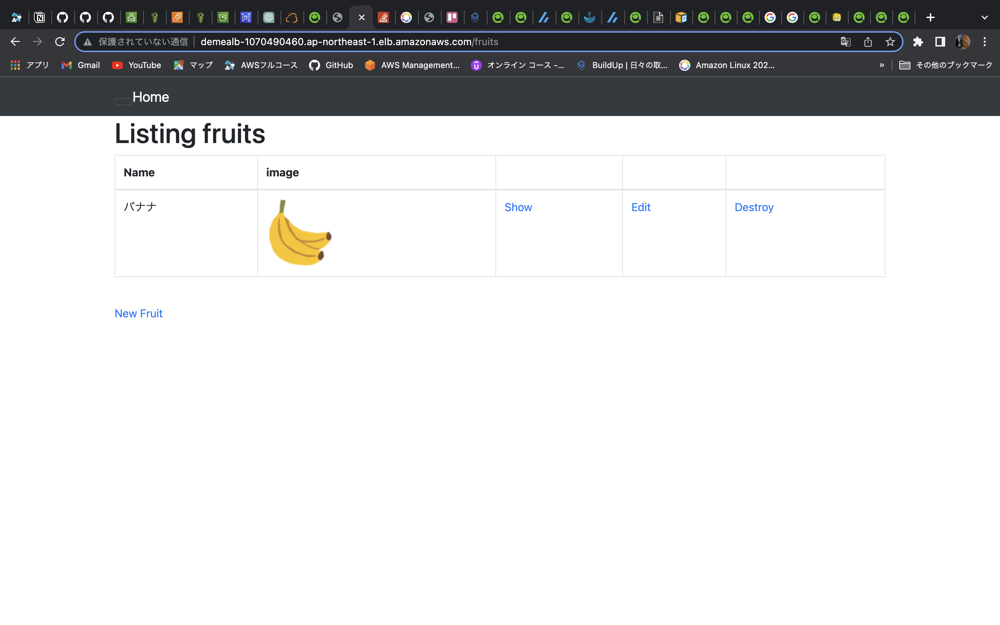
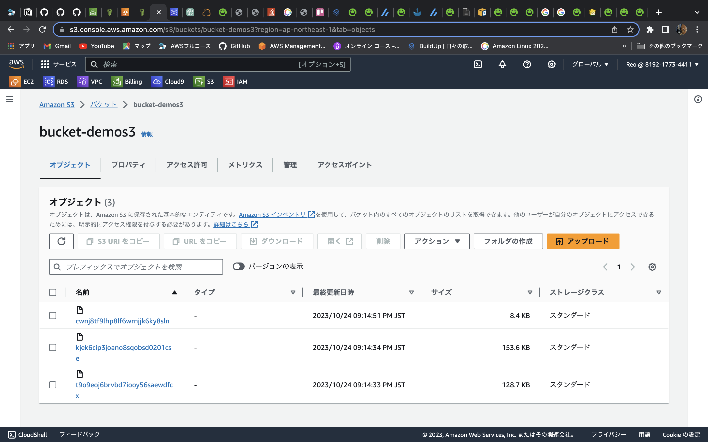
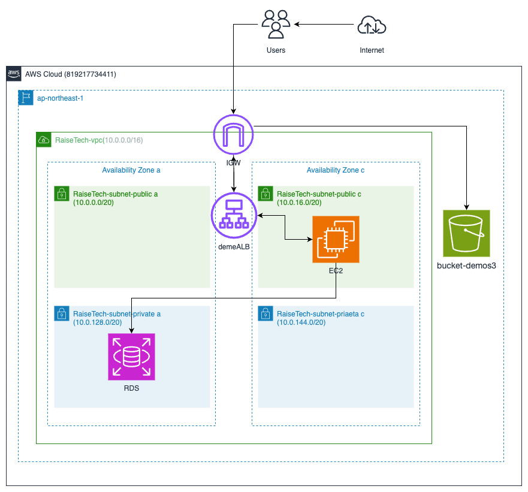

# 第5回課題
* 組み込みサーバーで起動

* nginxとunicornで分けてデプロイ

# ALBの導入
* ALBを経由してサンプルアプリのデプロイ

# アプリのデータ保存先をS3に変更
* データの保存先をS3した

# インフラ構成図

## 学んだこと
課題を終えるのにすごく時間がかかった。  
EC2の作り直しやヘルスチェックの問題など、色々なとことでつまづいた。  
環境が壊れた時のために手順書を予め作っておくともしもの時にすぐに元に戻せるのでこれからは何をしたかメモを残すようにする。  
S3に保存先を変えるのも難しくしていただけで分かるとすんなり出来た。本番環境でやろうとしていたけど本番環境にするだけでやることが多くて進めることが出来なかった。