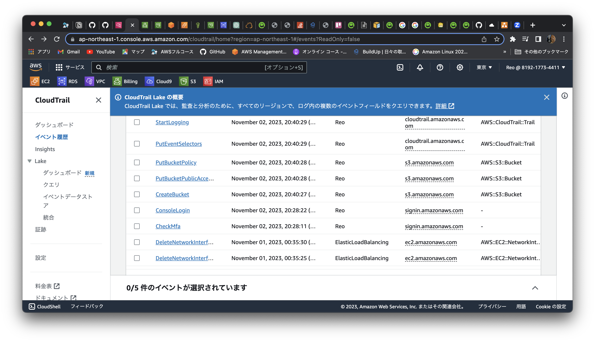
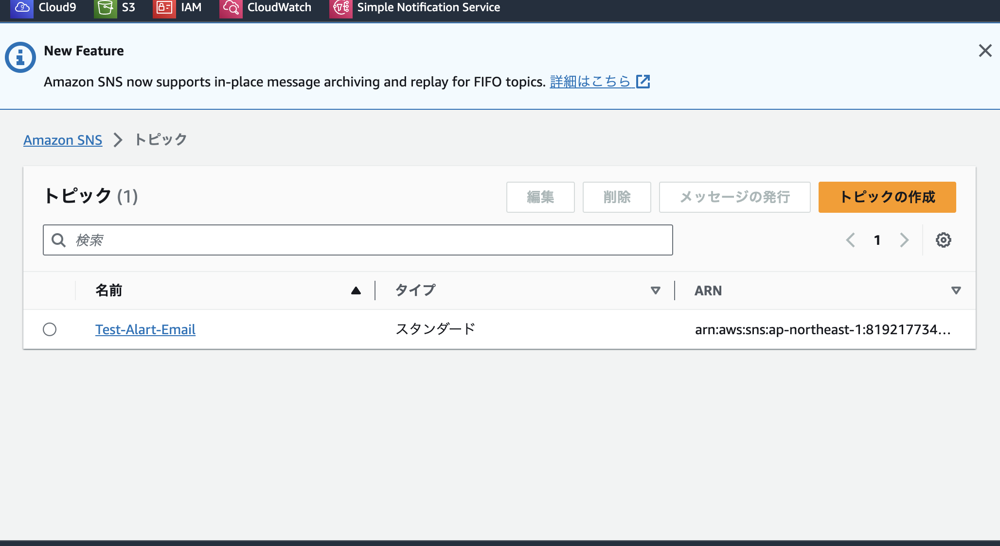
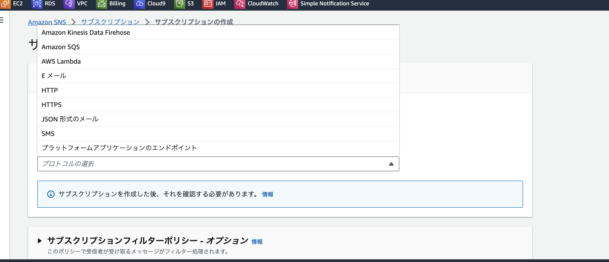
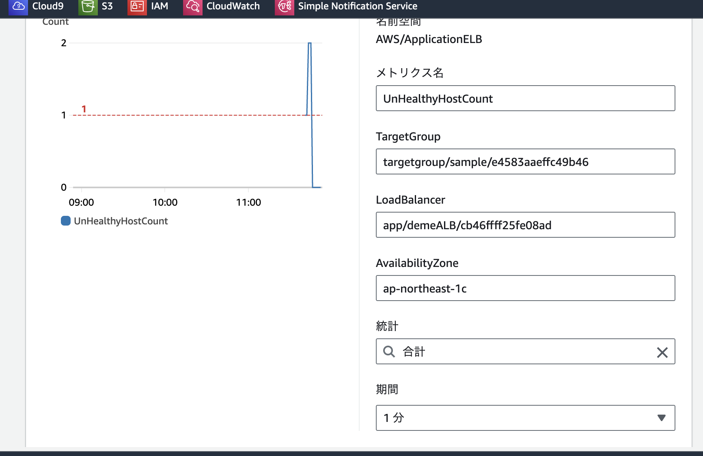
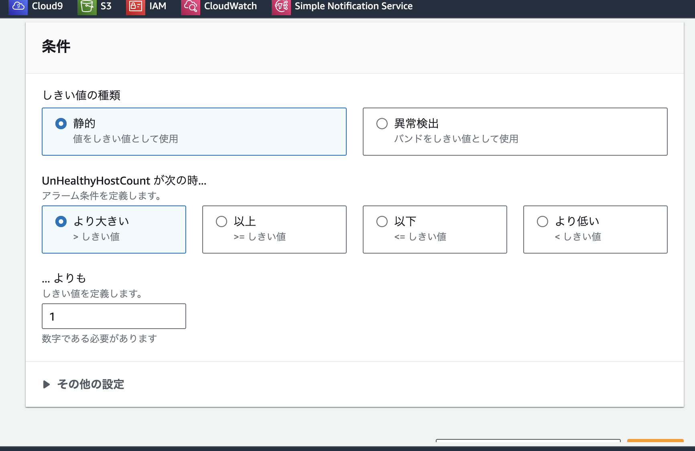
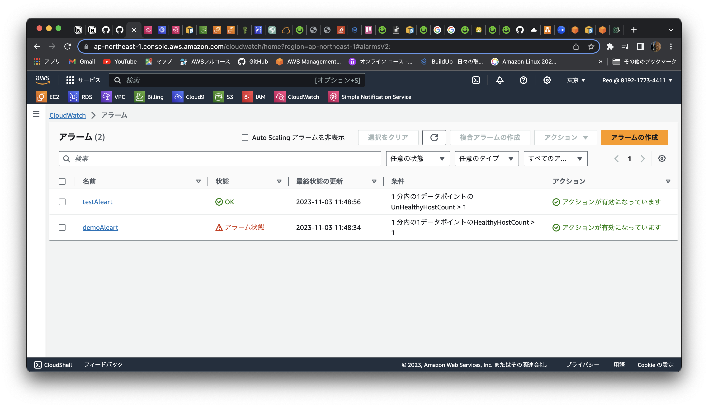
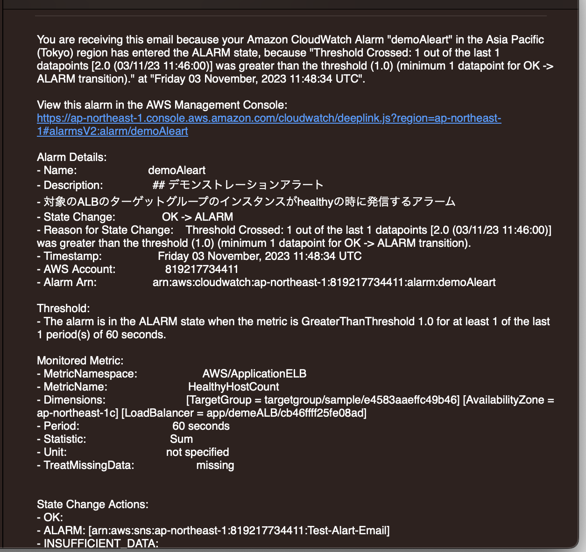
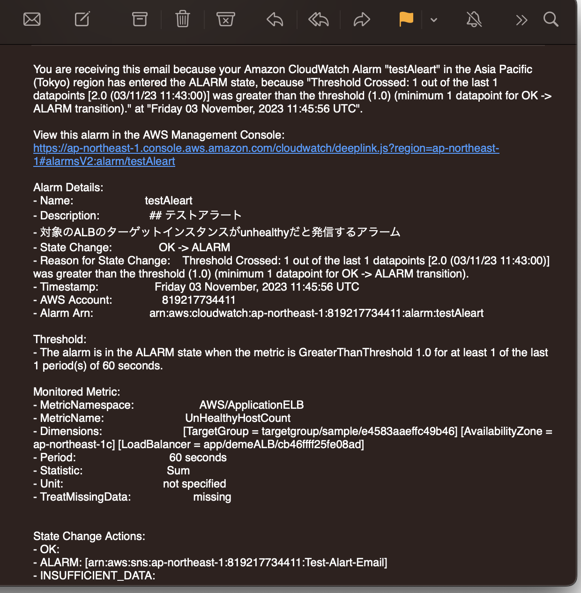
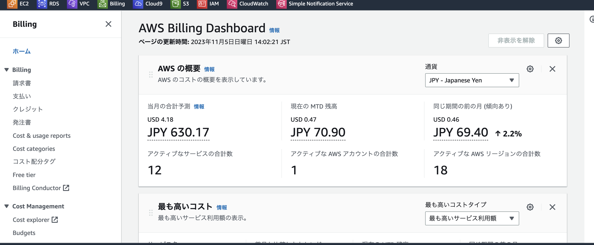

# 第６回課題

## cloud Trailを使って証跡を取る
- cloud trailを有効化

##### イベント名         
1. DeleteNetworkInterf..　　EC2
2. PutBucketPublicAcce.  　 S3
3. StartLogging　　　　　cloudTrail

## アラートの設定
- アラートを設定するにはAmazonSNSでプッシュ通知を受信するメールを設定する
- AmazonSNSでトピック作成

- サブスクリプション作成

###### cloud Watchでアラート作成

- アラート作成時にamazonSNSで設定したプッシュ通知が送られるメールを設定する
### アラートの確認
- healthyの時のアラート

- unhealthyの時のアラート

# AWS 利用料の見積もり
- 見積書 
https://calculator.aws/#/estimate?id=7fcc745c2a43952ba7c769c535ed811e2d436831

- 現在の利用料

### 感想
- 消費税込みで719円の請求ですこし無料枠を超えた
- 第５回に比べるとデモンストレーションを見ながらスムーズにできた

