# 第６回課題

## cloud Trailを使って証跡を取る
- cloud trailを有効化
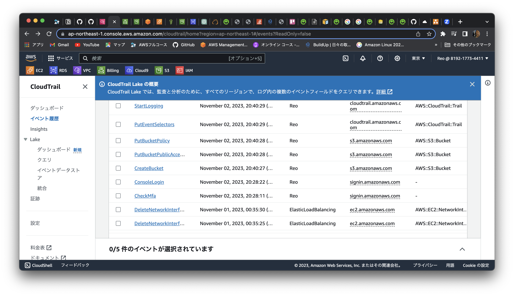
##### イベント名         
1. StartDBInstance
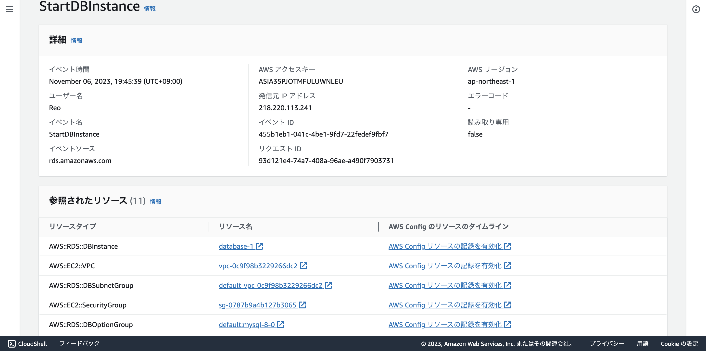
2. StartInstances
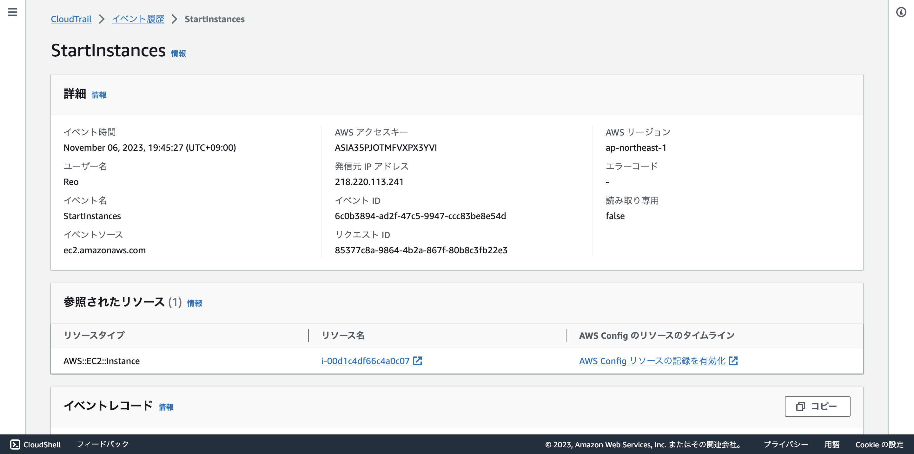
3. StopDBInstance
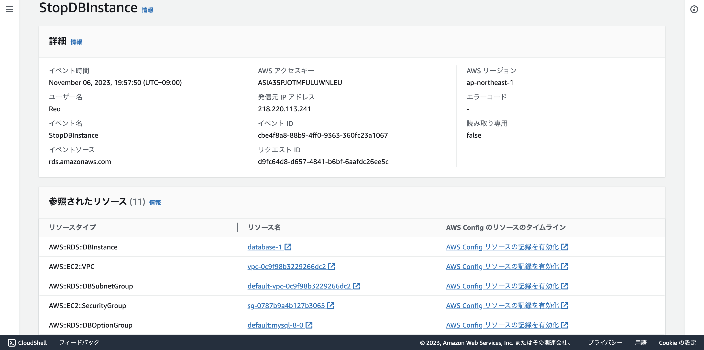
## アラートの設定
- アラートを設定するにはAmazonSNSでプッシュ通知を受信するメールを設定する
- AmazonSNSでトピック作成
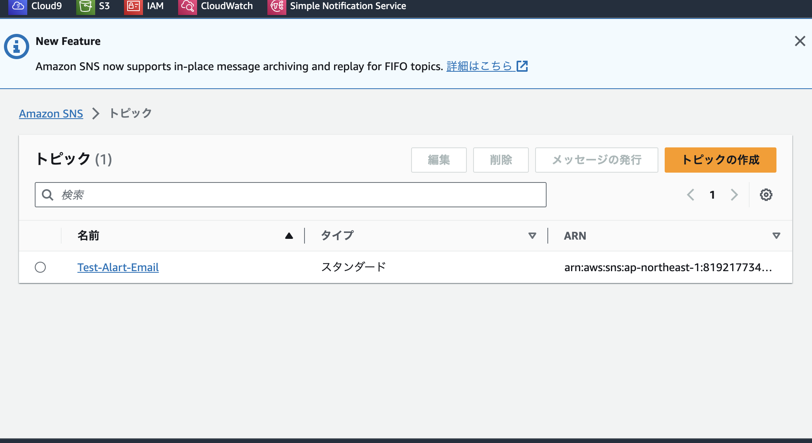
- サブスクリプション作成
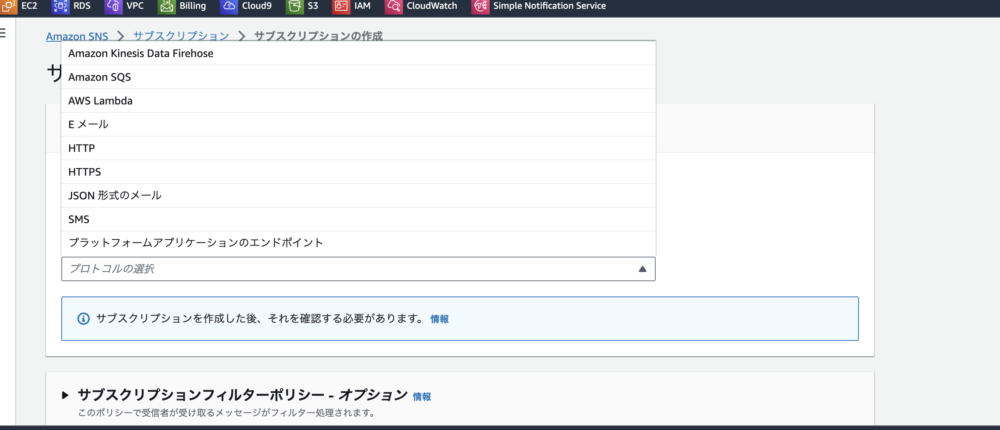
###### cloud Watchでアラート作成

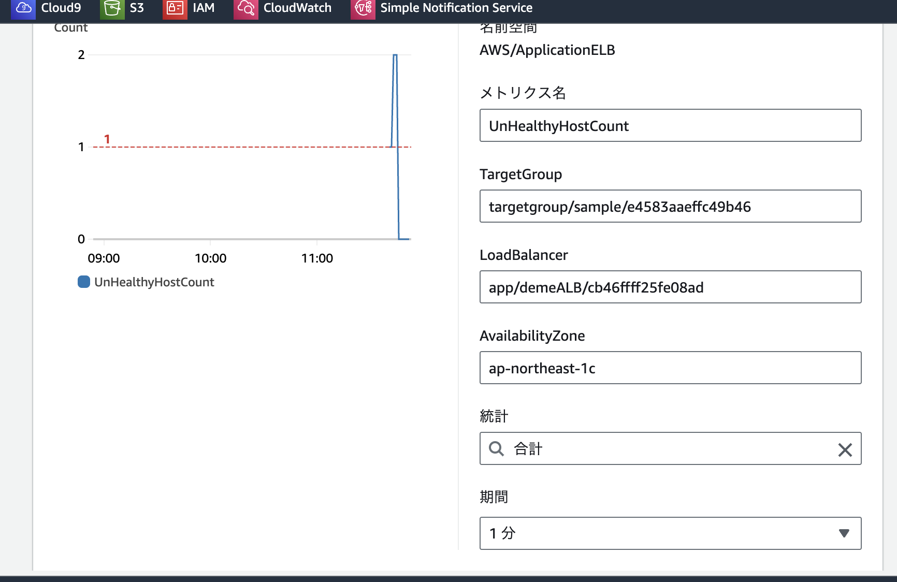

- アラート
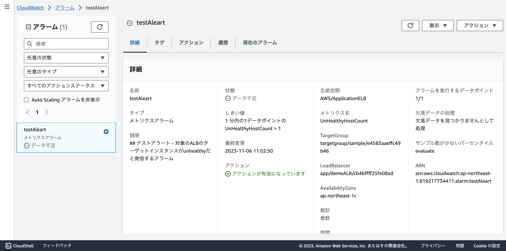
- アクション
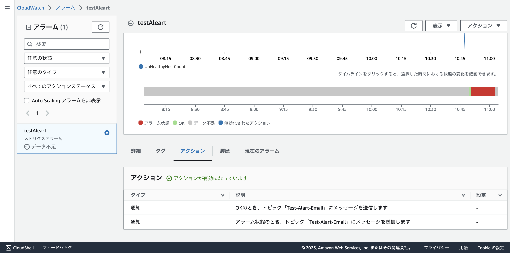

- アラート作成時にamazonSNSで設定したプッシュ通知が送られるメールを設定する
### アラートの確認
-状態ok->alarm
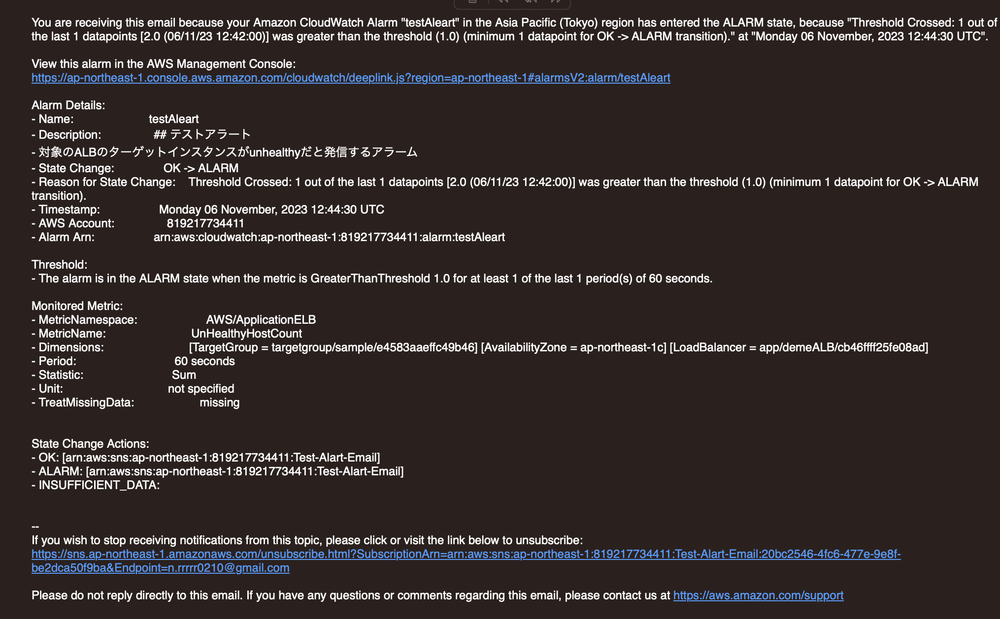

- 状態　alarm->ok
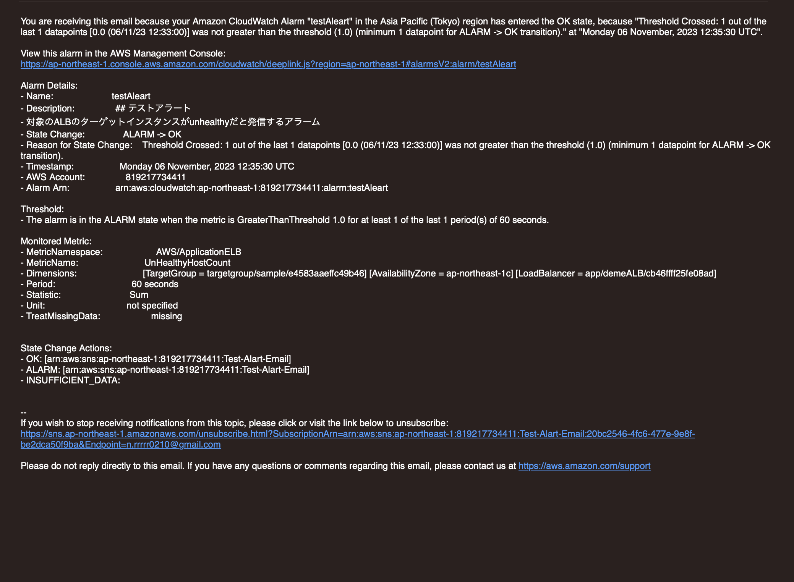
# AWS 利用料の見積もり
- 見積書 
https://calculator.aws/#/estimate?id=f4ecb1fed3ddf1f53a148f66a055c813b45f4a39

- 現在の利用料
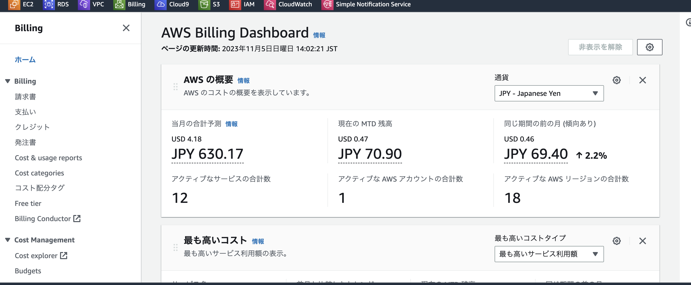
- EC2の利用料金
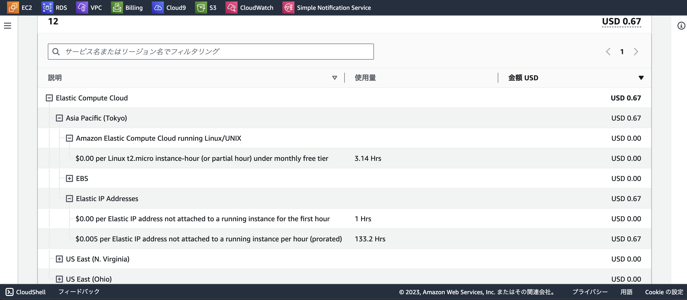
### 感想
- 消費税込みで719円の請求ですこし無料枠を超えた。
- エンジニアになり実際に仕事をしていく上でログがどれほど大切か分かった

- 第５回に比べるとデモンストレーションを見ながらスムーズにできた

