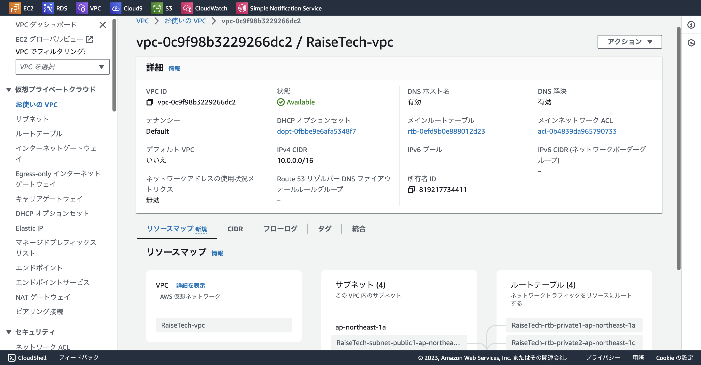
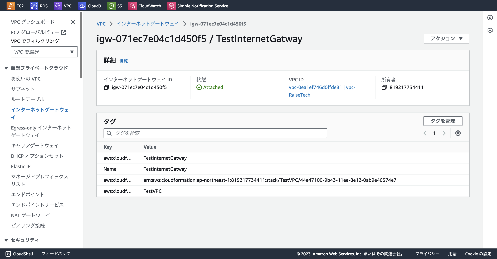
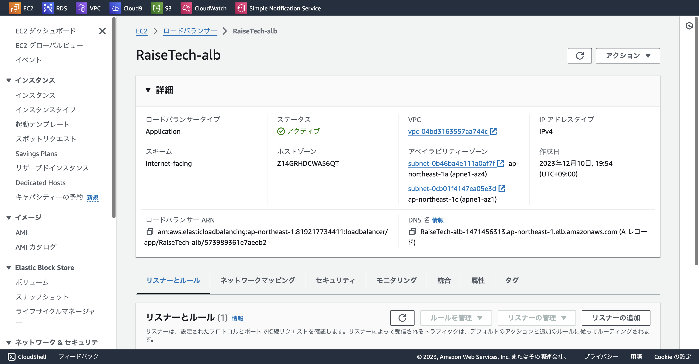
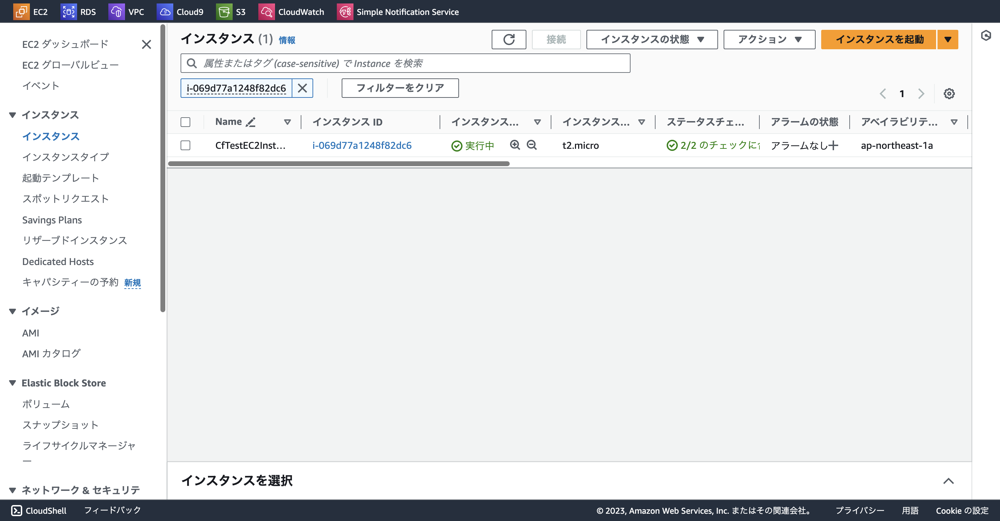
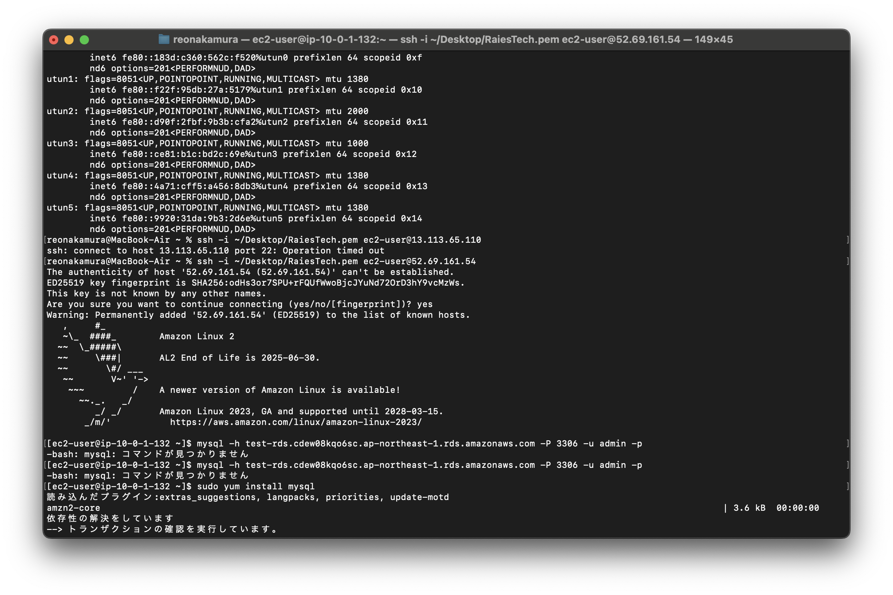
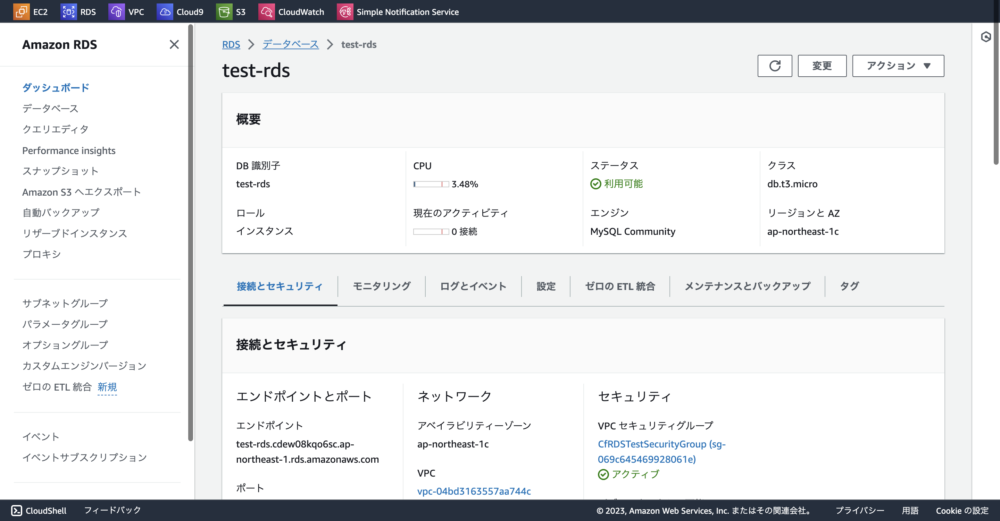
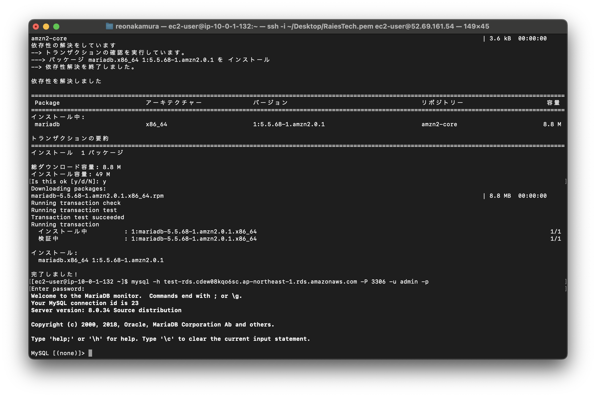

# 第10回課題
## cloudformationを利用して環境構築をコード化する

### 第５回と同じ環境をテンプレートで構築
- スタック  
VPC.YAML  
EC2-RDS.YAML  
の二分割で構成
- テンプレートのコードをimage/lecture10/のCF-Templateファイルに保存

## 構築した環境

- VPC

- IGW

- SecurityGroup
.png)
- ALB

- EC2

- EC2接続

- RDS

- RDS接続

