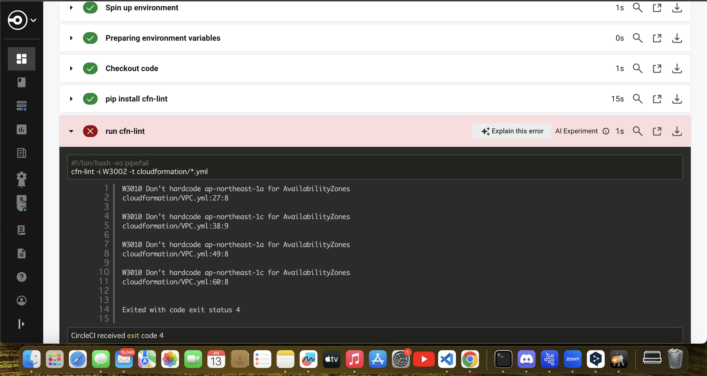
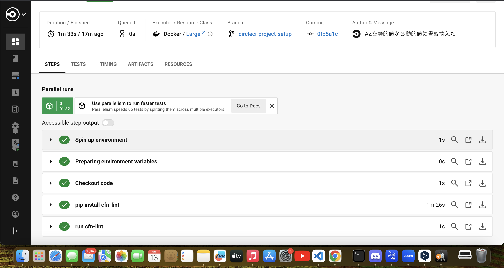

# 第12回課題

## circleciを使って提供されたコンフィグファイルを動作させる

- circleciのアカウントを作成

- 新規プロジェクトでgithubのリポジトリを指定してプロジェクトの作成
- 自動的にディレクトリとコンフィグファイルが生成されてるのでデフォルト設定を提供されたコンフィグファイルに書き換える
```zsh
#生成されたファイル
.circleci/config.yml
```
- 設定を書き換えてaddするとgithubに`circleci-project-setup`ブランチが自動生成される

## circleciが正常に動作しない

- プロジェクトセットアップまでは成功

- jobの`run cfn-lint`で失敗するのでエラーの確認



- エラーの説明を見るとサブネットのAZの値がハードコーディングで可用性がそこなわれていると分かったので動的値に書き換えた

## circleciが正常に動作した

- 書き直して再実行すると全てのワークフローが成功した

## 学んだ事

- 書いたコードが正しく動作するかリリース前にテストする事が大事で、そのテストをCI/CDツールを使って自動化することでテストのミスをなくせたり作業効率が上がる。  
circleciのAIエラー説明が分かりやすくてどこを修正すべきかすぐ理解できた。