# 13回課題

##  CircleCIにServerSpecとAnsibleの処理を追加する

デプロイ自動化構成図

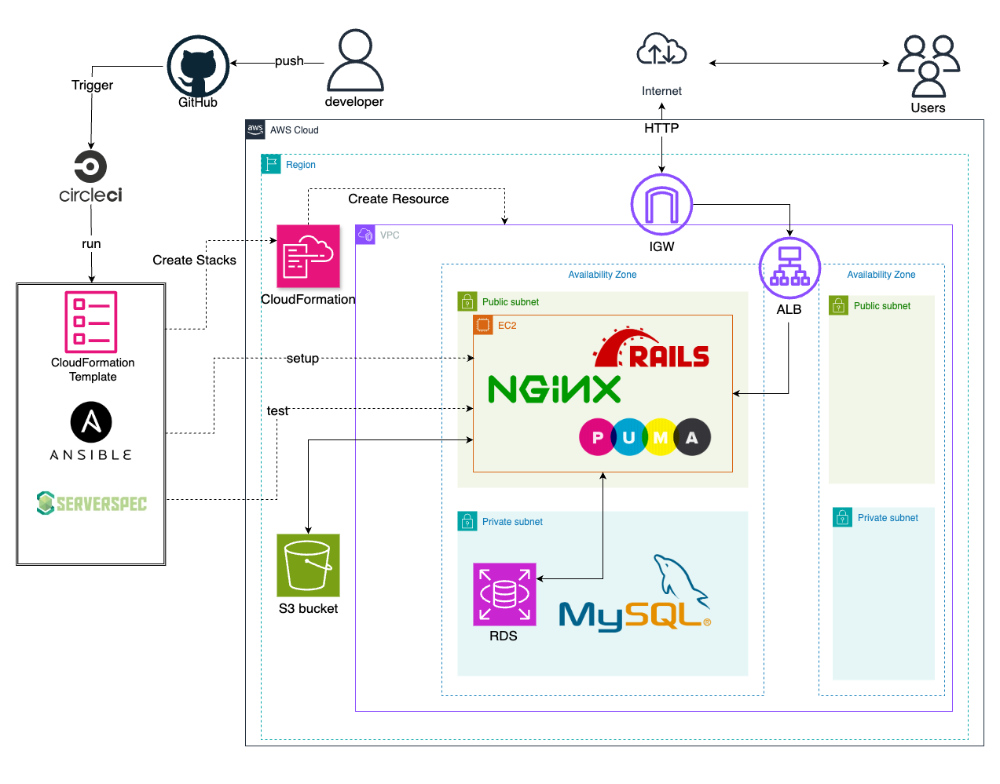

　　
- コードの詳細はこちらに記載しています
[課題で使ったリポジトリ](https://github.com/ReoNakamura/lecture13)

#### 事前準備
- ec2の接続に使うキーペアは事前に作成したものを使用しています

## circleciの環境変数の設定

##### Project Settings
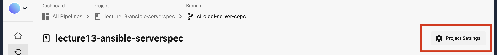

##### Enviroment Varisbles
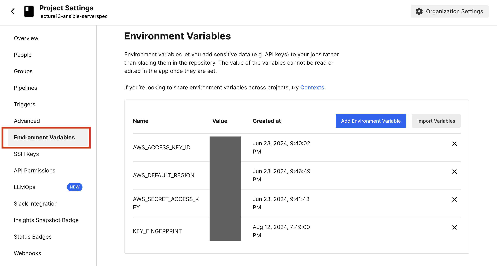

## cirleci/comfig.ymlにansibleとserverspecの処理を追加する

### circleciの実行結果
1. 全てのワークフロー 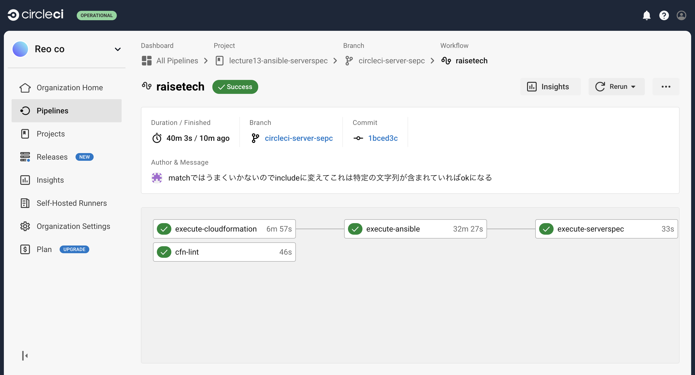

2. cfn-lint 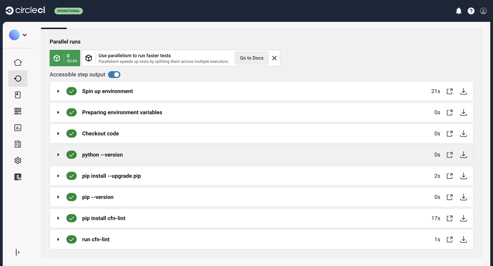

3. execute-cloudformation 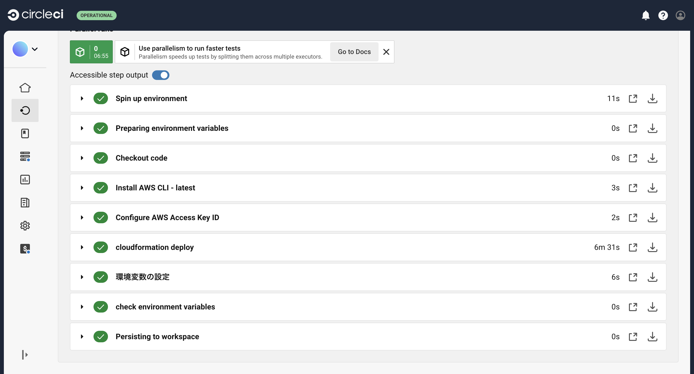

4. execute-ansible 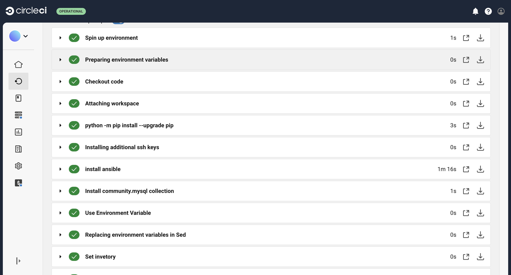
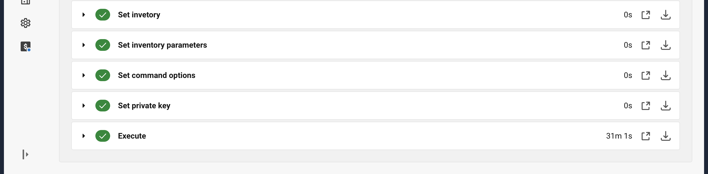

5. execute-serverspec 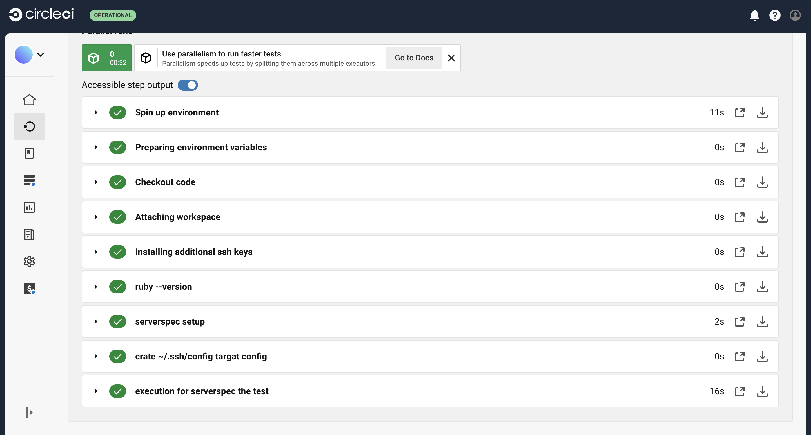

#### サンプルアプリケーションの動作確認
1. ALBのDNSにアクセスして画像をアップロード
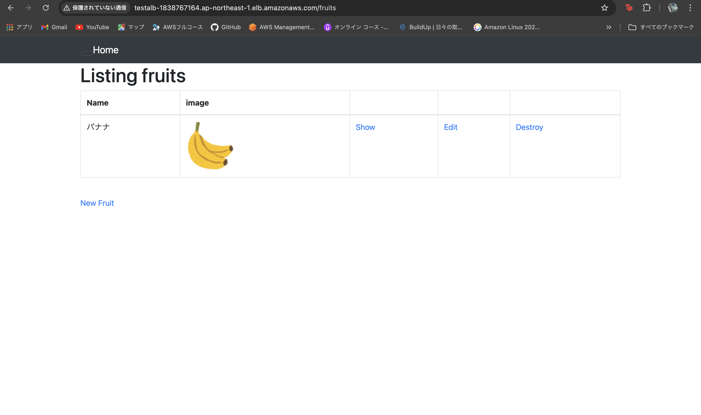
2. 保存先がS3になっているか確認
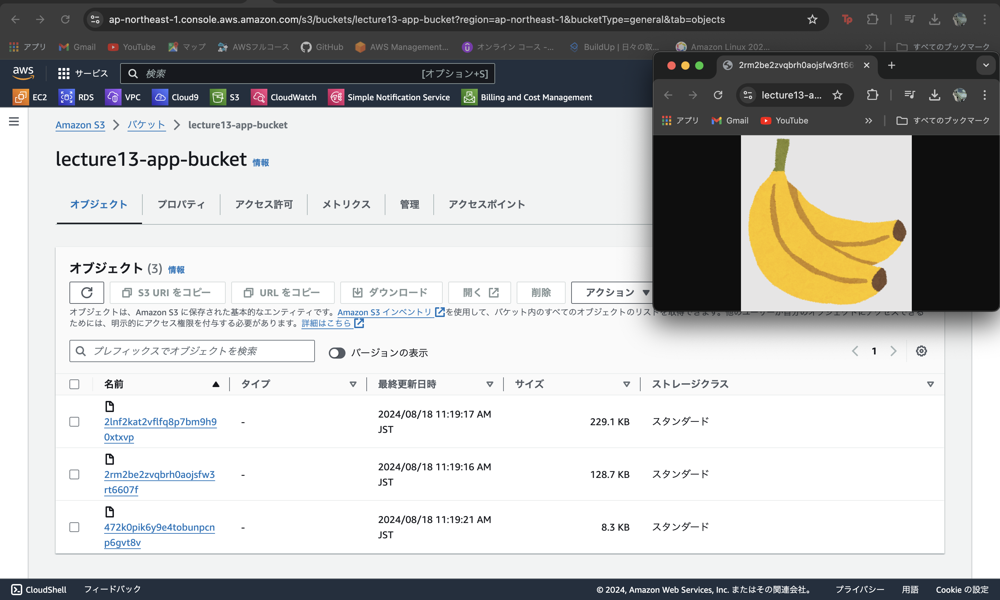

## 苦戦したところ
ansible-playbookを作るのに時間がかかってしまった。リモートで環境を構築するとき権限の問題や挙動がローカルでした時と違うので苦労した。

## 感想

cirrcleciなどのCI/CDツールとansibleを組み合わせると、コード管理やビルド・テストが素早くできて、もっと理解を深めて活用すれば開発に役立つとおもいました。
